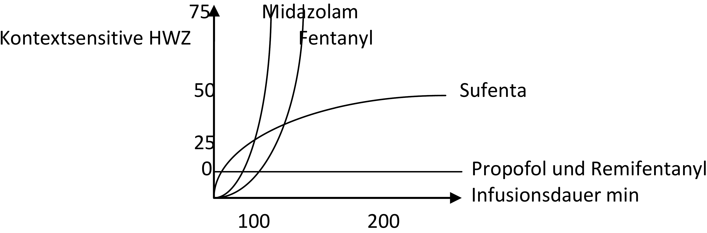

# Intravenöse Anästhetika

:::{margin}

:::

Binden an Liganden-gesteuerten Ionen Kanälen: GABA, Glycin, 5 HT3 und neuronale AchRezeptoren, NMDA, AMPA und an G-Protein gekoppelte Rezeptoren:
z.B. Dexdor α2-Rezeptoren im ZNS.
(Ausnahme Ketamin: bindet NICHT an GABA, Glycin, nAch, sondern an NMDA!!!)

Sie sind fettlöslich und können rasch durch Zellmembranen und Kapillaren diffundieren = Abfall
der Plasmakonzentration durch Verteilung in den Kompartimenten!

**Die Neurotransmitter GABA (Gehirn) und Glycin (RM, Hirnstamm)** sind die wichtigsten schnell
hemmenden Neurotransmitter = Ligand, die zu einer Öffnung des Chloridkanals mit Einstrom von
Chloridionen in die Zelle, und damit zu einer Hyperpolarisation mit Verminderung der neuronalen
Erregbarkeit führen.

GABA-Agonisten
:   Benzodiazepine (Diazepam, Midazolam,…) und ein kompetitiver Antagonist ist Flumazenil (Anexate™), allerdings mit kurzer Wirkdauer mit Rebound Phänomen.

## Benzodiazepine
Wirkung: Anxiolyse, anterograde Amnesie, Sedierung, muskelrelaxierende Wirkung, antikonvulsiv

Cave: langsamer Wirkungseintritt, Titration über Minuten!

Je nachdem wie viele GABA-Rezeptoren besetzt sind: Anxiolyse \< Sedierung \< hypnotische Wirkung

Benzodiazepine erniedrigen die Atemantwort auf Hyperkapnie!

Midazolam/Dormicum
:   3-6fach so potent wie Diazepam, hohe Proteinbindung, zuerst wasserlöslich, aber im Blut schließt sich der Ring, und es wird lipophil.

    Hepatischer Metabolismus über Hydroxylierung und CYP-450 (blockiert durch Diflucan, Verapamil, Erythromycin,…) = verzögerte Elimination beim leberkranken, geriatrischen, und septischen Patienten.

Lorazepam
:   5-10fach potenter wie Diazepam; Alternative für IBS: Leber- und Nierenerkrankungs-unabhängige Elimination, durch Konjunktion mit Glukuronsäure zu inaktiven Metaboliten.

3-Kompartmentmodell mit Wirkort
:   Hypnotikum verteilt sich in schnellen, zentralen und langsamen Kompartimenten.
    Gleichzeitig setzt die Elimination ein = maximale Konzentration am Wirkort ist erreicht, wenn sich die Kurven der Blut- und Wirkortkonzentration treffen. z.B. Time to peak Effekt von Propofol = 2,2min.

## Barbiturate / Thiopental

Hohe Lipidlöslichkeit (BHS + plazentagängig), schwache Säure, bei Azidose vermehrt in nicht ionisiertem Zustand; hohe Proteinbindung;
Bei iv. Injektion nach 15-20 Sekunden Wirkung im Gehirn und Herz (neg. inotrop), dann Umverteilung = rasches Erwachen durch Umverteilung nicht Elimination.
Bei Dauerinfusion sind Gewebekompartimente und Enzymsystem der Leber gesättigt = Kumulation = Elimination nach nicht linearer Kinetik (Zw. 300 und 600 mg konstante Menge/Zeit) = langsames Aufwachen durch 10 x geringere Clearance als Propofol.
Wird über Niere und Galle als wasserlösliche inaktive Metaboliten abgebaut.

NW
:   periphere venöse Vasodilation, Verminderung des Cardiac Output (verm. Preload, venöses Pooling, negativ inotrop va. bei zu rascher Injektion, vorübergehender verminderter
Sympathikusimpuls vom ZNS), Blutdruckabfall (10-20%) mit kompensatorischen HF-Anstieg (Aktivierung der Barorezeptoren im Carotissinus), Bronchospasmus.

Einleitungsdosis
:   4-6mg/kg KG (va. bei alten Patienten LANGSAM!!!), erhöhte Dosis bei Kindern, da großes HZV (3x BV/min) + rasche Umverteilung; Säuglinge 6-8mg/kg KG (Sectio 4 – 6 mg/kg KG keine Auswirkung auf das NG)

ZNS
:   Antikonvulsiv, Antianalgetisch (senkt Schmerzschwelle), Atemregulation (vermindert Atemantwort auf Hypoxie und erhöhtem CO₂), senkt ICP durch Vasokonstriktion mit reduziertem CBF und senkt O₂-Bedarf des ZNS.

Kann akute intermittierende Porphyrie auslösen!

Thiopental ist inkompatibel mit Rocuronium, Succinylcholin, Midazolam, Alfentanil, und Sufenta, daher nie im gemeinsamen Schenkel verabreichen!!!

## Propofol

:::{margin}

:::

Stark lipophil, nicht wasserlöslich in Emulsion aus Sojabohnenöl (Sojaallergie!!), Lecithin, Glycerin und Eiphosphatid (Eiallergie?); Um Bakterienwachstum zu verhindern ist EDTA oder Sulfit zugesetzt, welche Allergien und Bronchospasmus auslösen können.

Injektionsschmerz
:   20 ml Lidocain zu 20 ml Propofol, Fentanyl Vorgabe.

Dosis
:   Kinder 3-5 mg / kg KG, Erwachsene 1-2,5 mg / kg KG, Geriatrische Patienten 1-1,75 mg / kg KG langsam injizieren!

    -   TIVA: 3-9 mg / kg / h
    -   Sedierung: 1,5-4,5 mg / kg / h
    -   Antiemetisch: 10-20 mg Bolus alle 5-10 Minuten, 0,6 mg / kg / h

Nebenwirkung
:   Abnahme von MAP, CO, SVR (Vasodilatation, vermind. SVR, neg. inotrop, vermindert Barorezeptorenreflex), HF unverändert oder Bradykardie bis AV-Block sind möglich.

Apnoe (> 60 s) nach AN-Einleitung durch Verminderten Atemantrieb auf Hypoxie und CO2, setzt die Reaktivität der Atemwege (Husten, Glottisschluss) herab.

Propofolinfusionssyndrom siehe KINDER! (> 48 h Sed mit \> 5 mg / kg / h + > 5 h Narkose)
Es wirkt antiemetisch, daher Einsatz bei PONV.

Elimination
:   Konjungation zu wasserlöslichen Metaboliten (Glukuronide und Sulfate) in der Leber, Clearance (2l/min) übersteigt den Leberfluss und ist auch bei Leberzirrhose und CNI nicht wesentlich beeinflusst, daher besteht wahrscheinlich auch ein extrahepatischer Mechanismus?

TIVA mit Propofol
:   Zielplasmakonzentration = durchschnittlich 3 µg / ml

    1.  Manuelles Propofol-Infusions-Regime:
        Bolus 1 mg / kg + 10-8-6 (für 10 Minuten 10 mg / kg, für weiter 10 Minuten 8 mg / kg, danach 6 mg / kg / h)
        nicht ideal Zielplasmakonzentration wird erst nach ca. 30 Minuten erreicht.
        (Prämedizierte Patienten und Ältere brauchen weniger)

    2.  TCI (Target Controlled Infusion):
        Steuerung nach Größe, Gewicht und Alter anhand von Modellen (Marsh Plasma Modus, Schnider Wirkort Modus)

Narkosetiefe
:   Unzuverlässige Zeichen: Blutdruck und HF, Somatische Zeichen (Tränenfluss, Schwitzen,…) PRST (Pressure, Heartrate, Sweat, Tears)-Score

    Bedingt zuverlässige Zeichen: unwillkürliche Abwehrbewegungen beim nicht relaxierten Patienten.

Awareness
:   0,1-0,2% bewusstes Wacherleben ohne Schmerzen, 1,2%
Awareness.
    Häufig Bewusstseinsleistungen ohne Erinnerung und unbewusste Erinnerung.

    Daher Monitoring der Schlaftiefe mit spontanem EEG (BIS, NARKOTREND) oder akustisch evoz. Potentialen, MAC bei volatilen Anästhetika.

BIS = Bispektralindex
:   = Sedierungstiefe korreliert mit EEG-Muster
    (empirisch aus 5000 BIS festgestellt)
    Die Wahrscheinlichkeit einer motorischen Reaktion (Augen öffnen) korreliert schlecht mit dem BIS, aber mit der Wirkortkonzentration von Propofol, und sehr stark mit der Opiatkonzentration am Wirkort. = TIVA mit BIS + Opioidlastig!! 40-60 in AN (= normalisierte niedrigfrequente EEGAktivität)

    \<30 spricht man von einer Burst Suppression!

Narkotrend™
:   ist eine Ableitung eines Roh-EEG´s über 3 Elektroden an der Stirn.
    Die Narkosestadien werden mit Hilfe eines numerischen Index von 0 bis 100 eingeteilt.

Kontext sensitive HWZ
:   = Zeit die nach Beendigung der Infusion eines Pharmakons notwendig ist, bis die Plasmakonzentreation um 50% abgefallen ist.
    Kontext bezieht sich auf die Dauer der Infusion.

    

**Lange Aufwachzeiten nach langer TIVA ergeben sich aus der verlängerten 80% Konzentrationsabfallskurve von Propofol, die deutlich länger braucht als Remifentanil.**
Daher Propofol beim Zunähen stoppen, und Remifentanil höher drehen!

## Etomidate (Hypnomidate™)

Geringe kardiovaskuläre NW, daher vor allem bei kardiovaskulär instabilen Patienten (> ASA III) geeignet.

Nachteil: hemmt die Steroid-Produktion der NNR bis zu einigen Wochen lang (Sepsis!) mit erhöhter Mortalität nach Langzeitsedierung bei ISB-Patienten.

Nach Bolusgabe 24 h Hemmung.

NW
:   Myoklonien, Injektionsschmerz, PONV. Abbau in der Leber. KEINE repetitive Anwendung!!

Indikation
:   Notfallintubation bei schweren Schockzuständen (kardialer Schock) und SHT!

Alternative
:   Niedrig dosiertes Propofol mit Ketamin kombiniert! Notfallintubation nur mit Ketamin.

## Ketamin/Ketanest

:::{margin}

:::

= dissoziative Anästhesie mit Bewusstseinsverlust und Analgesie unter weitgehend erhaltenen Reflexen (Husten und Schluckreflex bei hohen Dosen eingeschränkt!).
Wirkungseintritt 10-15 min nach Gabe mit weiten Pupillen, Tränen- und Speichelfluss, erhöhtem Muskeltonus und unwillkürlichen Bewegungen.
Ketanest = S-Isomer mit 2fach stärkerer anästhetischer Wirkung als R-Isomer, mit weniger psychomimetischen NW.

Wirkt über NMDA-Rezeptor und NICHT über GABA-A!!
Führt zu einer selektiven Hemmung neuronaler Funktionen im Cortex und Thalamus mit Stimulation des limbischen Systems und des Hippocampus (psychomimetische NW).
Binden auch an µ-Opioidrezeptoren im RM und Gehirn (Prophylaxe des chron. Schmerzes), lokalanästhetische Wirkung und neuroprotektive Wirkung.

Der zentrale Atemantrieb wird wenig beeinflusst.
Bronchodilation.
Bei Kindern Atemregulation (CO₂-Response) beeinflusst + Gefahr des Laryngospasmus durch Speichelfluss!
Daher keine Anwendung bei Kleinkindern und Säuglingen.

Ketamin stimuliert den Sympathikus durch Hemmung der NA-Wiederaufnahme = Anstieg von HF, RR, CO nicht dosisabhängig!

Wirkt negativ inotrop, daher KI bei KHK und ACS!
Eine Abschwächung des Sympathikus (ZNS) wurde bei Dauerinfusion und Midazolam Prämedizierung beobachtet.

Dosis
:   -   0,5-2 mg / kg KG für Einleitung AN
    -   Sedierung und Analgesie: 0,2-0,8 mg / kg innerhalb von 2-3 Minuten
    -   Präventive Analgesie: 0,15-0,25 mg / kg KG
        Senkt den Opioidbedarf! Faustregel: 0,25 mg / kg KG als Kurzinfusion postoperativ zur Schmerztherapie.

ZNS
:   neuroprotektiv wenn ICP konstant bei kontrollierter Beatmung und Normokapnie, Kombination mit Dormicum.

Ind
:   Risikopatienten, Trauma Patienten, Notfallintubation beim septischen Schock, Pat. mit hyperreagiblem Bronchialsystem,…
